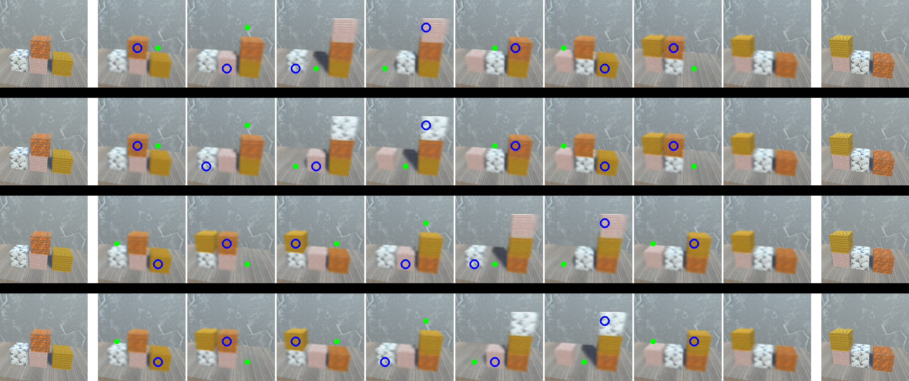

# Latent Space Roadmap
This is the code for the paper: "[Latent Space Roadmap for Visual Action Planning of Deformable and Rigid Object Manipulation](https://arxiv.org/abs/2003.08974)"

Visit the dedicated website: [Latent Space Roadmap website](https://visual-action-planning.github.io/lsr/) for more information.

If you use this code in your work, please cite it as follows:

## Bibtex

```
@misc{lippi2020latent,
    title={Latent Space Roadmap for Visual Action Planning of Deformable and Rigid Object Manipulation},
    author={Martina Lippi and Petra Poklukar and Michael C. Welle and Anastasiia Varava and Hang Yin and Alessandro Marino and Danica Kragic},
    year={2020},
    eprint={2003.08974},
    archivePrefix={arXiv},
    primaryClass={cs.RO}
}
```

## Stacking example

### setup

```
pip install -r requirements.txt
```

### Datasets

Download LSR stacking datasets [LSR stacking datasets](https://kth.box.com/s/v8pazzecg5rn0qjxconcr97l33f0goas) and place in "datasets" folder.


### Train models
To make train and test split use:
```
import pickle
from dataloader import preprocess_triplet_data
preprocess_triplet_data('unity_stacking.pkl')
```

To train the VAE use:
```
python train_VAE.py --exp_vae=VAE_UnityStacking_L1  --cuda=True
```

To train the APN use:
```
touch models/APN_UnityStacking_evaluation_results.txt

python train_APN_stacking.py \
                --exp_apn=APN_UnityStacking_L1  \
                --seed=98765 \
                --generate_new_splits=1 \
                --generate_apn_data=1 \
                --train_apn=1 \
                --eval_apn=1 \
                --cuda=True
```


### execute stacking LSR example

```
python lsr_stacking_example.py --seed=98765 --lable_ls=True --build_lsr=True --example=True
```

You should get a image like this in the root folder as a result: (depending on your random seed)




